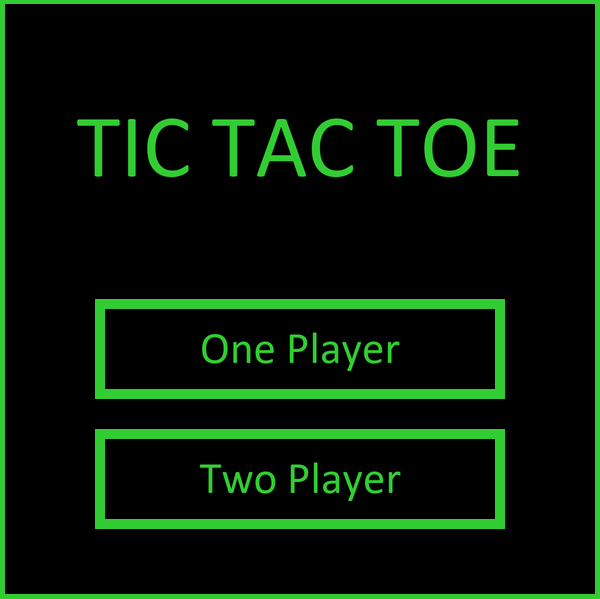

# TicTacToe
Tic Tac Toe with an Unbeatable AI

Used Python, along with the arcade library, to recreate Tic Tac Toe, with both single-player and two player modes. The single-player mode features an unbeatable AI.

 
